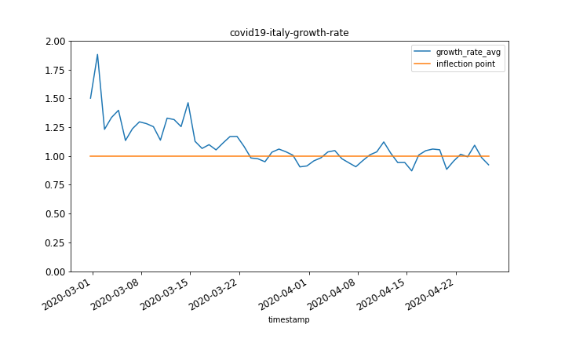
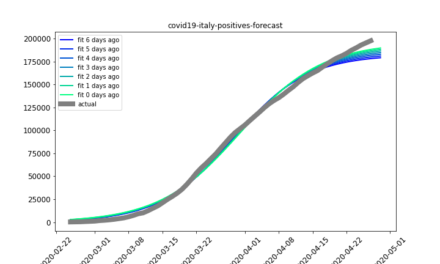
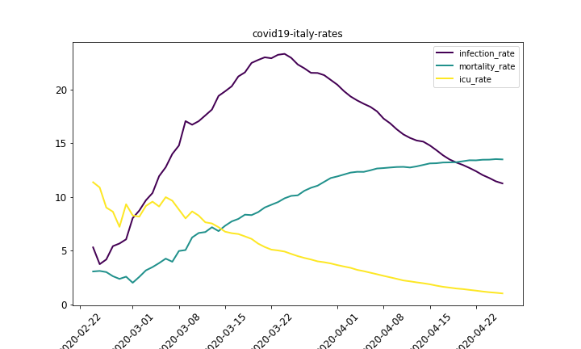

## What
1. Data from Italy and Australia and visualise positive cases of COVID19 over time.
2. Fit a sigmoid model to the cumulative positive count
3. The effect of new data on the model predictions
4. The growth rate of the virus
5. A plot to identify the inflection point (growth rate=1)

## Datasets
- [Protezione Civile](https://github.com/pcm-dpc/COVID-19)
- [WHO](https://github.com/CSSEGISandData/COVID-19)

## Results
- Restrictions (started at around 2020-03-15) reduced the growth rate considerably.
- Cumulative positives is well described by an "S" curve
- There are not enough ICU units
- The infection rate increases over time because testing has gradually been restricted to patients with more severe symptoms, more likely to test positive.

## Resources
[Exponential growth and epidemics - Youtube](https://www.youtube.com/watch?v=Kas0tIxDvrg&feature=youtu.be)

## Previews

